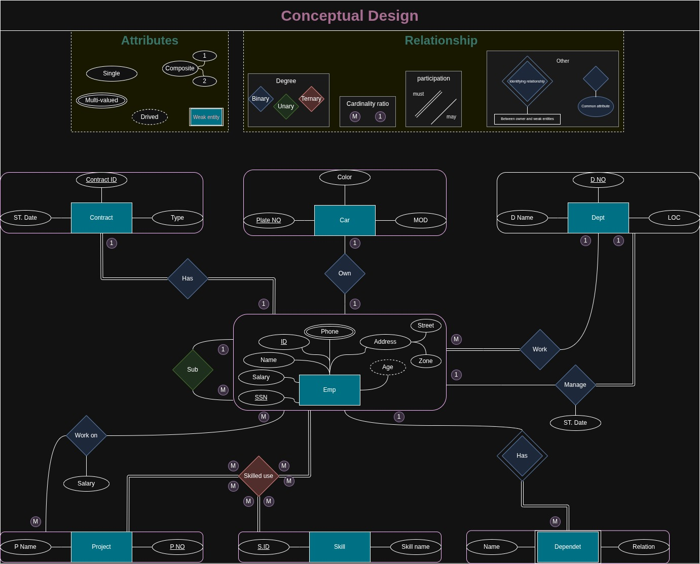

# Conceptual ERD Design

This repository contains a summarized **Entity-Relationship Diagram (ERD)** from a Database Fundamentals course.  
The ERD demonstrates key concepts such as:
- Attributes (single, multi-valued, composite, etc.)
- Relationships (binary, unary, ternary)
- Weak entities
- Participation and cardinality
- Example involving Employees, Projects, Skills, Departments, etc.

## ERD Summary Image

---

<h3 align="center">
  
</h3>
